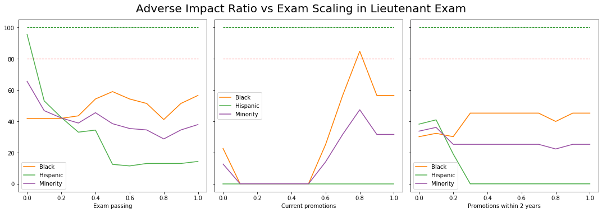

# DATA20019 Trustworthy Machine Learning

## Project 3, Firefighters

Eeva-Maria Laiho

---

# Presentation 1

2.12.2019

---

# Case: Firefighter Promotions

* New Haven FD administered an exam for firefighters to apply for promotion 
* Score of 70% or higher was required to pass for promotion
* Exam results would be valid for promoting for the next 2 years 
* City charter required that when k promotions are made the promotees must be selected from the k+2 top scorers (of the exam)
* At the time there were: 8 open positions for Lieutenant, 7 for Captain
* Within 2 years a total of 16 Lieutenant and 8 Captain positions became available
* Total of 118 firefighters took the exam

---

# Exam Results

<small>Miao, W. (2010). Did the results of promotion exams have a disparate impact on minorities? Using statistical evidence in Ricci v. DeStefano. Journal of Statistics Education, 18(3).</small>

---

# Lawsuit: Ricci v. DeStefano

* City of New Haven decided not to certify the exam and no one was promoted
    * Insufficient number of minorities would be getting a promotion 
* The high-scoring test takers filed a lawsuit against the city on the grounds of reverse discrimination
* Both District Court and Trial Court decided in favor of city of New Haven
    * On the basis of "four-fifths rule" and adverse impact ratio 
* Supreme Court ruled in favor of the firefighters
    * The exam results had to be certified

---

# Data

* 118 observations, 5 variables
    * Race: Race of firefighter (B=black, H=Hispanic, or W=white)
    * Position: Promotion desired (Captain or Lieutenant)
    * Oral: Oral exam score
    * Written: Written exam score
    * Combine: Combined score (written exam gets 60% weight)

| Race | Position | Oral | Written | Combine |
| --- | --- | --- | --- | --- |
| H | Captain | 79.05 | 74 | 76.02 |
| W | Captain | 73.81 | 77 | 75.724 |
| W | Captain | 76.67 | 74 | 75.068 |
| B | Captain | 82.38 | 70 | 74.952 |
|...|

---

# Discriminatory measures (original data)

* Adverse impact ratio (pass rate)
    * For Lieutenant:
        * 31.6% / 58.1% = 54% (black / white)
        * 20% / 58.1% = 34.4% (hispanic / white)
    * For Captain:
        * 37.5% / 64% = 58.6% (black / white)
        * 37.5% / 64% = 58.6% (hispanic / white)
* All are below 80% from the guideline

---

# Task

* Predict who is promoted now (8+7 positions) / within 2 years (16+8 positions)
    * Logistic Regression model
    * 70-30 train-test split

* Compute discriminatory measures for predicted data
    * Adverse impact ratio

---

# Presentation 2

12.12.2019

---

# Adverse Impact Ratio

* This metric is typically used for exam scoring
* In U.S. Adverse Impact Ratio is used in discrimination cases
* There is a method to mitigate: Disparate Impact Remover
    * Proposed by Feldman et al.
* IBM Fairness 360 kit support

---

# Exam Scaling

---

# IBM Fairness 360 Toolkit (aif360)

* Supports multiple bias mitigation algorithms
    * Bias metrics
        * Binary Label Dataset Metric
        * Classification Metric
    * Bias removal methods
        * Pre-processing (e.g. Disparate Impact Removal)
        * In-processing
        * Post processing
* AI Fairness 360 Open Source Toolkit https://aif360.mybluemix.net/
* GitHub https://github.com/IBM/AIF360 (Source code, Examples)
* Documentation https://aif360.readthedocs.io/en/latest/
 
---

# Disparate Impact Remover (aif360)

* Bias mitigation method, proposed by Feldman et al., 2015
* Tackles Adverse Impact Ratio
* Edits feature values to increase group fairness
    * Pre-processing
* Preserves rank-ordering within a group

---

# Detect Disparate Impact (aif360.explainers.MetricJSONExplainer)

---

# Remove Disparate Impact 

---

# Results on Repair Level 0.675 (Original Data)

| | Original | Repair level 0.675 | N | 
| --- | --- | --- | --- |
| N Passed Minority  | 9 | 15 | 34 |
| N Passed Majority  | 25 | 23 | 43  |
| Adverse Impact Ratio  | 45.5 % | 82.5 % | - |

| | Combine | 
| --- | --- | 
| Min Pass Score for Minority | 18.45 |
| Max No-Pass Score for Majority | 65.35 |

---

# To Do

* Train a Logistic Regression classifier on Original data
    * Apply Disparate Impact Remover
    * Repair level 0.675
* Sample M times from the original dataset { Majority, Oral, Written }
* Measure Disparate Impact
* Visualize results

---

# Thank you